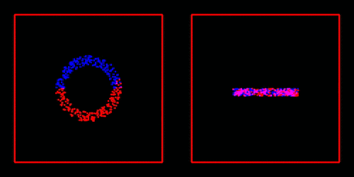
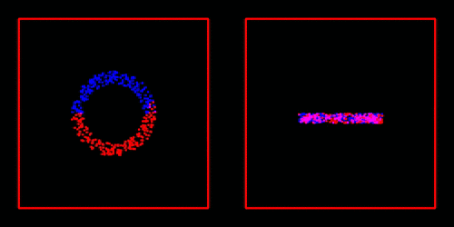

# SPH

**Parallel Smooth(ed) Particle Hydrodynamics (SPH) implementation for astrophysical simulations including self-gravity.**

* SPH corresponds to short range forces
* (self-) gravity correpsonds to long range forces
	* implemented via the Barnes-Hut algorithm (see [1])
	* see [MichaelSt98/NNS](https://github.com/MichaelSt98/NNS/tree/main) for different implementations
* parallel implemententation via the **M**essage **P**assing **I**nterface

Example: **NBody** (self-gravity)

Example: **SPH** (SPH + self-gravity)

## Usage

### Compilation

* Compilation via `Makefile`
	* `make` to build project
	* `make remake` to clean and afterwards build
	* `make clean` to delete object files
	* `make cleaner` to delete object files and binaries 

### Settings

**Settings via config files (`.info`)**

* *config/config.info* 
* *config/rendering.info*

| setting             | example value | description                                             |
|---------------------|---------------|---------------------------------------------------------|
| numParticles        | 200           | number of particles (per process)                       |
| systemSize          | 5.            | system size in every direction                          |
| timeStep            | .15           | integration time step                                   |
| timeEnd             | 100.0         | integrate until reached                                 |
| initMass            | 1e-4          | (initialization value for) mass of particles            |
| initVel             | .125          | (initialization value for) velocity of particles        |
| smoothingLength     | 0.5           | smoothing length of particles                           |
| outputRank          | 0             | rank to output in the shell (`-1` to output all ranks)  |
| loadBalancing       | true          | load balancing y/n                                      |
| distributionType    | 0             | which initial distribution to use                       |
| curveType           | 0             | which space-filling curve to use (Lebesque or Hilbert)  |

### Running

* run via
	* `mpirun -np <number of processes> ./bin/runner`
	* `mpiexec -n <number of processes> ./bin/runner`

### Debugging

* serial debugger (lldb/gdb) per process
	* MacOS
		* run `./debug/lldb_debug.sh`
		* breakpoints/settings in *debug/initPipe.lldb*
	* Linux distribution (tested on Ubuntu)
		* run `./debug/gdb_debug.sh`
		* breakpoints/settings in *debug/initPipe.gdb*
* [Valgrind](https://valgrind.org/) (only available on Linux distributions e.g. Ubuntu)
	* run 
		* `mpirun -np <number of processes> valgrind ./bin/runner` 
		* `mpirun -np <number of processes> valgrind --leak-check=full ./bin/runner` 

### Postprocessing

* If simulation saved as pictures `.ppm` within *images/*
	* create movie via `./utilities/createMP4` 
		* `open movie.mp4` 
	* create gif from movie via `./utilities/createGifFromMP4`
		* `open output.gif` 

## References

* **[1]** M. Griebel, S. Knapek, and G. Zumbusch. **Numerical Simulation in Molecular Dynamics**: Numerics, Algorithms, Parallelization, Applications. 1st. Springer Pub- lishing Company, Incorporated, 2010. isbn: 3642087760
	* **within the following sections:** 
	* 8 Tree Algorithms for Long-Range Potentials 
	* 8.1 Series Expansion of the Potential 
	* 8.2 Tree Structures for the Decomposition of the Far Field 
	* 8.3 Particle-Cluster Interactions and the Barnes-Hut Method 
		* 8.3.1 Method 
		* 8.3.2 Implementation
		* 8.3.3 Applications from Astrophysics
	* 8.4 **ParallelTreeMethods**
		* 8.4.1 **An Implementation with Keys** 
		* 8.4.2 **Dynamical Load Balancing** 
		* 8.4.3 **Data Distribution with Space-Filling Curves**

