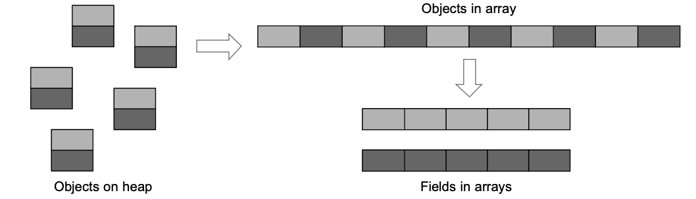
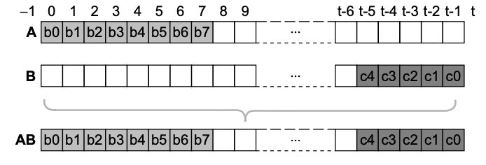
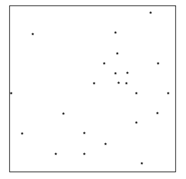
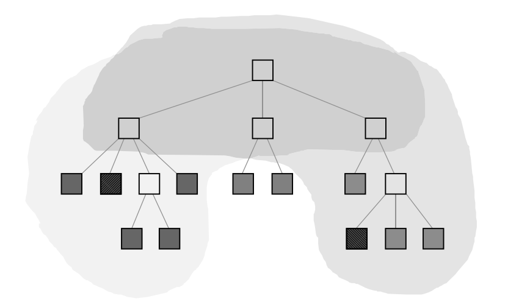
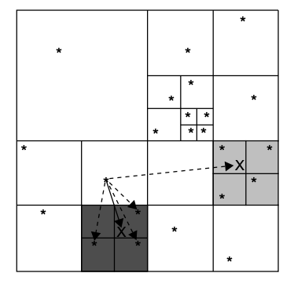

# NBody CUDA

## TODO

* check whether Kernels are working as expected
* mechanism to copy data from GPU to CPU in order to visualize after every iteration
	* position 
	* velocity (for colouring)
* convert CPU representation to GPU representation of Bodies
	* class to array structure  

## Links

* [An Efficient CUDA Implementation of the Tree-Based Barnes Hut n-Body Algorithm](https://iss.oden.utexas.edu/Publications/Papers/burtscher11.pdf)
* [CUDA examples: nbody](https://github.com/ndd314/cuda_examples/tree/master/5_Simulations/nbody)
* [Patistar/Nbody-Barnes-Hut-CUDA](https://github.com/Patistar/Nbody-Barnes-Hut-CUDA)

## Theoretical

See [An Efficient CUDA Implementation of the Tree-Based Barnes Hut n-Body Algorithm](https://iss.oden.utexas.edu/Publications/Papers/burtscher11.pdf), which describes a CUDA implementation of the classical Barnes Hut n-body algorithm that runs entirely on the GPU. The code builds an irregular treebased data structure and performs complex traversals on it.

**The Barnes Hut algorithm is challenging to implement efficiently in CUDA, since**

1. it repeatedly builds and traverse an irregular tree-based data structure
2. performs a lot of pointer-chasing memory operatons
3. is tipically expressed recursively, which is not supported by current GPUs 
4. traversing irregular data structures often results in thread divergence

**Possible solutions to these problems**

* iterations instead of recursion
* load instructions, caching, and throttling threads to drastically reduce the number of main memory accesses
* employing array-based techniques to enable
some coalescing
* grouping similar work together to minimize divergence

**Exploit some unique archtictural features of nowadays GPUs:**

* threads in a warp necessarily run in lockstep, having one thread fetch data from main memory and share the data with the other threads without the need for synchronization
* barriers are implemented in hardware on GPUs and are therefore very fast, therefore it is possible to utilize them to reduce wasted work and main memory accesses in a way that is impossible in current CPUs where barriers have to communicate through memory
* GPU-specific operations such as thread-voting
functions to greatly improve performance and make use of fence instructions to implement lightweight
synchronization without atomic operations

### Mapping Barnes Hut algoirthm to GPU kernels


**High-level steps:**

* [CPU] Reading input data and transfer to GPU
* *For each timestep do:*
	* [GPU] compute bounding box around all bodies
	* [GPU] build hierarchical decomposition by inserting each body into an octree
	* [GPU] summarize body information in each internal octree node
	* [GPU] approximately sort the bodies by spatial distance
	* [GPU] compute forces acting on each body with help of octree
	* [GPU] update body positions and velocities
* [CPU] Transfer result to CPU and output 

#### Global optimzations

Global optimizations, meaning optimizations and implementations applying to all Kernels.

* Because dynamic allocation of and accesses to heap objects tend to be slow, an **array-based data structure** is used
* Accesses to arrays cannot be coalesced if the array elements are objects with multiple fields, so several aligned scalar arrays, one per field are used
	* thus, array indexes instead of pointers to tree nodes 



* to simplify and speed up the code, it is important to use the same arrays for both bodies and cells
*  allocate the bodies at the beginning and the cells at the end of the arrays, and use an index of −1 as a “null pointer”
	* a simple comparison of the array index with the number of bodies determines whether the index
points to a cell or a body   
	*  it is possible to alias arrays that hold only cell information with arrays that hold only body information to reduce the memory consumption while maintaining a one-to-one
correspondence between the indexes into the different arrays



* the thread count per block is maximized and rounded down to the nearest multiple of the warp size for each kernel
* all kernels use at least as many blocks as there are streaming multiprocessors in the GPU, which is automatically detected
*  all parameters passed to the kernels, such as the starting addresses of the various arrays, stay the same throughout the time step loop, so that they can be copied once into the GPU’s constant memory
* the code operates on octrees in which nodes can have up to eight children, it contains many loops with a trip count of eight. Therefore the loops are unrolled (e.g. by pragmas or compiler optimization)

#### Kernel 1: computes bounding box around all bodies

Kernel 1 computes the bounding box around all bodies, whic becomes the root node (outermost cell) of the octree.



The kernel needs to find the minimum and maximum coordinates. For doing so, the kernel breaks up the data into equal sized chunks and assigns one chunk to each block. Each block then performs a reduction operation. The reduction is done in a shared memory in a way that avoids bank conflicts and minimizes thread divergence. The last block, as is determined by a global atomicInc operation, combines these
results and generates the root node.

#### Kernel 2: hierachically subdivides the root cells 

Kernel 2 hierarchically subdivides this cell until there is at most one body per innermost cell. This is accomplished by inserting all bodies into the octree. 


The second kernel implements an iterative tree-building algorithm that uses lightweight locks, only
locks child pointers of leaf cells, and deliberately slows down unsuccessful threads to reduce the memory pressure. The bodies are assigned to the blocks and threads within a block in round-robin fashion.
Each thread inserts its bodies one after the other by traversing the tree from the root to the desired
last-level cell and then attempts to lock the appropriate child pointer (an array index) by writing an
otherwise unused value (−2) to it using an atomic operation. If the
locking succeeds, the thread inserts the new body, thereby overwriting the lock value, which releases
the lock. If a body is already stored at this location, the thread first creates a new cell by atomically
requesting the next unused array index, inserts the original and the new body into this new cell, executes a memory fence to ensure the new subtree is visible to the rest of the cores, and
then attaches the new cell to the tree, thereby releasing the lock. The threads that fail to acquire a lock have to retry until they succeed. 

```
// initialize
cell = find insertion point(body); // nothing is locked, cell cached for retries
child = get insertion index(cell, body);
if (child != locked) {
	if (child == atomicCAS(&cell[child], child, lock)) {
	if (child == null) {
		cell[child] = body; // insert body and release lock
		} else {
			new cell =...; // atomically get the next unused cell
			// insert the existing and new body into new cell
			threadfence(); // make sure new cell subtree is visible
			cell[child] = new cell; // insert new cell and release lock
		}
		success = true; // flag indicating that insertion succeeded
	}
}
syncthreads(); // wait for other warps to finish insertion
```

#### Kernel 3: computes the COM for each cell

Kernel 3 computes, for each cell, the center of gravity and the cumulative mass of all contained bodies.


The third kernel traverses the unbalanced octree from the bottom up to compute the center of gravity and the sum of the masses of each cell’s children. Initially, all cells have negative masses, indicating that their true masses still need to be computed. Because the majority of the cells in the octree have only bodies as children, the corresponding threads can immediately compute the cell data. In fact, this can be done using coalesced accesses to store the
mass and position information until the threads in a warp start processing cells whose children are not
yet ready — this step forces threads to wait different amounts of time.

```
// initialize
if (missing == 0) {
	// initialize center of gravity
	for (/∗iterate over existing children∗/) {
		if (/∗child is ready∗/) {
		// add its contribution to center of gravity
		} else {
		// cache child index
		missing++;
		} } }
	if (missing != 0) {
		do {
		if (/∗last cached child is now ready∗/) {
		// remove from cache and add its contribution to center of gravity
		missing−−;
		}
	} while (/∗missing changed∗/ && (missing != 0));
}
if (missing == 0) {
	// store center of gravity
	threadfence(); // make sure center of gravity is visible
	// store cumulative mass
	success = true; // local flag indicating that computation for cell is done
}
```

#### Kernel 4: sorts the bodies

Kernel 4 sorts the bodies according to an in-order traversal of the octree, which typically places spatially close bodies close together

This kernel sorts the bodies in parallel using a top-down traversal. It employs the same array-based
traversal technique as the previous kernel except that the processing order is reversed; i.e., each thread
starts with the highest array index assigned to it and works its way down. It also uses a data field
as a ready flag. Based on the number of bodies in each subtree, which was computed in kernel 3, it
concurrently places the bodies into an array such that the bodies appear in the same order in the array
as they would during an in-order traversal of the octree. This sorting groups spatially close bodies
together.



#### Kernel 5: computes the forces

Kernel 5 computes the forces acting on each body.
Starting from the octree’s root, it checks whether the center of gravity is far enough away from the current body for each encountered cell. If it is not, the subcells are visited to perform a more accurate force calculation, if it is, only one force calculation with the cell’s center of gravity and mass is performed, and the subcells and all bodies within them are not visited, thus greatly reducing the total number of force calculations.



**The fifth kernel requires the vast majority of the runtime and is therefore the most important to optimize.**

For each body, the corresponding thread traverses some prefix of the octree to compute the force acting upon this body. 

Because threads belonging to the same warp execute in lockstep, every warp in this
kernel effectively has to traverse the union of the tree prefixes of all the threads in the warp. In other
words, whenever a warp traverses a part of the tree that some of the threads do not need, those threads
are disabled due to thread divergence, but they still have to wait for this part to be traversed. As a
consequence, it is paramount to group spatially nearby bodies together so that the threads in a warp
have to traverse similar tree prefixes, that is, to make the union of the prefixes as small as possible. This
is why the sorting in kernel 4 is so important. Some other optimizations:

* It does not write to the octree and therefore requires no
locks or ready flags
* It caches information that depends only on the tree-depth of a node in shared
memory


```
// precompute and cache info
// determine first thread in each warp
for (/∗sorted body indexes assigned to me∗/) {
	// cache body data
	// initialize iteration stack
	depth = 0;
	while (depth >= 0) {
		while (/∗there are more nodes to visit∗/) {
			if (/∗I’m the first thread in the warp∗/) {
				// move on to next node
				// read node data and put in shared memory
			}
			threadfence block();
			if (/∗node is not null∗/) {
				// get node data from shared memory
				// compute distance to node
			if ((/∗node is a body∗/) || all(/∗distance >= cutoff∗/)) {
				// compute interaction force contribution
			} else {
				depth++; // descend to next tree level
				if (/∗I’m the first thread in the warp∗/) {
				// push node’s children onto iteration stack
			}
				threadfence block();
			}
			} else {
				depth = max(0, depth-1); // early out because remaining nodes are also null
			}
		}
		depth−−;
	}
	// update body data
}
```

#### Kernel 6: updates the bodies

Kernel 6 nudges all the bodies into their new
positions and updates their velocities.

#### Optimization summary

* **Maximizing parallelism and load balance**
* **Minimizing thread divergence**
* **Minimizing main memory accesses**
* **Using lightweight locks** if locks are necessary
* **Combining operations** to avoid additional traversals
* **Maximizing coalescing**
* **Avoiding GPU/CPU transfers**