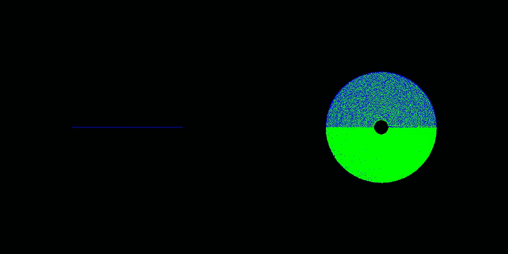
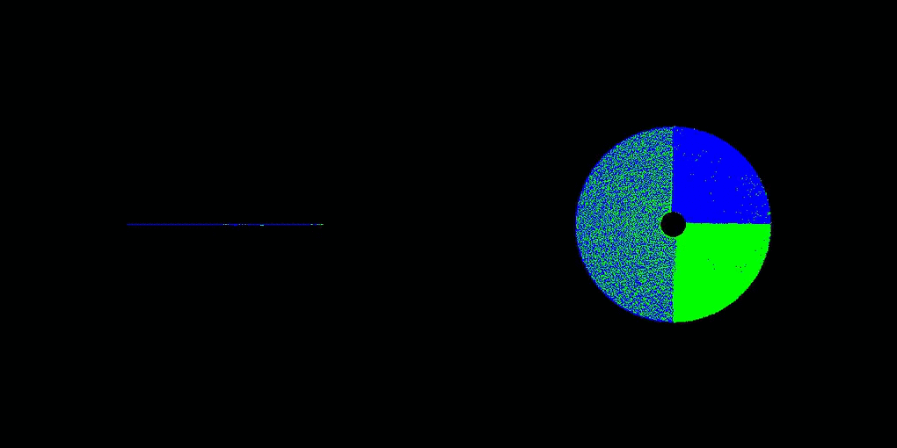

# Multi-GPU SPH/NBody using CUDA aware MPI

This repository aims to implement a **Multi-GPU SPH/NBody algorithm using CUDA aware MPI** by combining ideas from:

* **Single-GPU version adopted from:**
	* [An Efficient CUDA Implementation of the Tree-Based Barnes Hut n-Body Algorithm](https://iss.oden.utexas.edu/Publications/Papers/burtscher11.pdf)
	* [Patistar/Nbody-Barnes-Hut-CUDA](https://github.com/Patistar/Nbody-Barnes-Hut-CUDA)
	* [bneukom/gpu-nbody](https://github.com/bneukom/gpu-nbody)
	* [Implementation: MichaelSt98/NNS](https://github.com/MichaelSt98/NNS/tree/main/3D/CUDA/CUDA_NBody) CUDA\_NBody
* **Multi-Node (or rather Multi-CPU) version adopted from:**
	* M. Griebel, S. Knapek, and G. Zumbusch. Numerical Simulation in Molecular Dynamics: Numerics, Algorithms, Parallelization, Applications. 1st. Springer Pub- lishing Company, Incorporated, 2010. isbn: 3642087760
	* [Implementation: MichaelSt98/NNS (branch: MolecularDynamics)](https://github.com/MichaelSt98/NNS/tree/MolecularDynamics/MolecularDynamics/BarnesHutParallel)

**Primary aim is a proof of concept**, secondary is the optimization/fine-tuning. The (approximative) NBody algorithm is commonly recursively implemented, but GPUs are not convenient for recursive algorithms, thus trying to *translate* the recursive algorithms/functions into iterative ones or ones appropriate for the architecture of GPUs.

## Current status

**Proof of concept!**

* only tested for 2 GPUs within one node (shared memory) yet
	* despite one node (shared memory), using MPI for interprocess communication
* probably some (minor) bugs
* error-prone memory management
	* implementation requires *estimated* memory allocation at the beginning
	* ...

## Samples 

### Single-GPU 

* Single-GPU
* 524k particles
* colored in dependence of velocity
* view: x-y plane

### Multi-CPU example 

* Multi-CPU
* 2 processes, thus 2 cores
* colored in dependence of process
* view: x-y plane (left), x-z plane (right)

### Multi-GPU example

**Multi-GPU Lebesgue**

**Multi-GPU Hilbert**

## Usage

* **Compilation:** Use the `Makefile` to compile the code
	* `make` for optimized compilation
	* `make debug` for debug compilation 
* **Clean:**
	* `make clean` to remove object files ...
	* `make cleaner` to remove object files, binaries ...
* **Running:** `mpirun -np <numProcesses> ./bin/runner`
	* **-r, --render**              render simulation
	* **-i, --iterations**          number of iterations (default: 100)
	* **-n, --particles**           number of particles (default: 524288)
	* **-b, --blocksize**           block size (default: 256)
	* **-g, --gridsize**            grid size (default: 1024)
	* **-R, --renderinterval**      render interval (default: 10)
	* **-l, --loadbalancing**       load balancing
	* **-L, --loadbalancinginterval** load balancing interval
	* **-c, --curvetype**           curve type
	* **-v, --verbosity**           Verbosity level
	* **-h, --help**                Show this help
* **Visualization:** `./createMP4`
	* result is *movie.mp4* 

## Implementation

### Multi-CPU version

See: 

> M. Griebel, S. Knapek, and G. Zumbusch. **Numerical Simulation in Molecular Dynamics**: Numerics, Algorithms, Parallelization, Applications. 1st. Springer Pub- lishing Company, Incorporated, 2010. isbn: 3642087760 

within the following sections:

* 8 Tree Algorithms for Long-Range Potentials 
* 8.1 Series Expansion of the Potential 
* 8.2 Tree Structures for the Decomposition of the Far Field 
* 8.3 Particle-Cluster Interactions and the Barnes-Hut Method 
	* 8.3.1 Method 
	* 8.3.2 Implementation
	* 8.3.3 Applications from Astrophysics
* 8.4 **ParallelTreeMethods**
	* 8.4.1 **An Implementation with Keys** 
	* 8.4.2 **Dynamical Load Balancing** 
	* 8.4.3 **Data Distribution with Space-Filling Curves**

### Single-GPU implementation

See [An Efficient CUDA Implementation of the Tree-Based Barnes Hut n-Body Algorithm](https://iss.oden.utexas.edu/Publications/Papers/burtscher11.pdf), which describes a CUDA implementation of the classical Barnes Hut n-body algorithm that runs entirely on the GPU. The code builds an irregular treebased data structure and performs complex traversals on it.

**The Barnes Hut algorithm is challenging to implement efficiently in CUDA, since**

1. it repeatedly builds and traverse an irregular tree-based data structure
2. performs a lot of pointer-chasing memory operatons
3. is tipically expressed recursively, which is not supported by current GPUs
4. traversing irregular data structures often results in thread divergence

**Possible solutions to these problems**

* iterations instead of recursion
* load instructions, caching, and throttling threads to drastically reduce the number of main memory accesses
* employing array-based techniques to enable
  some coalescing
* grouping similar work together to minimize divergence

**Exploit some unique archtictural features of nowadays GPUs:**

* threads in a warp necessarily run in lockstep, having one thread fetch data from main memory and share the data with the other threads without the need for synchronization
* barriers are implemented in hardware on GPUs and are therefore very fast, therefore it is possible to utilize them to reduce wasted work and main memory accesses in a way that is impossible in current CPUs where barriers have to communicate through memory
* GPU-specific operations such as thread-voting
  functions to greatly improve performance and make use of fence instructions to implement lightweight
  synchronization without atomic operations

### Mapping Barnes Hut algoirthm to GPU kernels

**High-level steps:**

* [CPU] Reading input data and transfer to GPU
* *For each timestep do:*
    * [GPU] compute bounding box around all bodies
    * [GPU] build hierarchical decomposition by inserting each body into an octree
    * [GPU] summarize body information in each internal octree node
    * [GPU] approximately sort the bodies by spatial distance
    * [GPU] compute forces acting on each body with help of octree
    * [GPU] update body positions and velocities
    * ([CPU] Transfer result to CPU and output)
* [CPU] Transfer result to CPU and output 

#### Global optimzations

Global optimizations, meaning optimizations and implementations applying to all Kernels.

* Because dynamic allocation of and accesses to heap objects tend to be slow, an **array-based data structure** is used
* Accesses to arrays cannot be coalesced if the array elements are objects with multiple fields, so several aligned scalar arrays, one per field are used
    * thus, array indexes instead of pointers to tree nodes

* to simplify and speed up the code, it is important to use the same arrays for both bodies and cells
*  allocate the bodies at the beginning and the cells at the end of the arrays, and use an index of −1 as a “null pointer”
    * a simple comparison of the array index with the number of bodies determines whether the index
      points to a cell or a body
    *  it is possible to alias arrays that hold only cell information with arrays that hold only body information to reduce the memory consumption while maintaining a one-to-one
       correspondence between the indexes into the different arrays

* the thread count per block is maximized and rounded down to the nearest multiple of the warp size for each kernel
* all kernels use at least as many blocks as there are streaming multiprocessors in the GPU, which is automatically detected
*  all parameters passed to the kernels, such as the starting addresses of the various arrays, stay the same throughout the time step loop, so that they can be copied once into the GPU’s constant memory
* the code operates on octrees in which nodes can have up to eight children, it contains many loops with a trip count of eight. Therefore the loops are unrolled (e.g. by pragmas or compiler optimization)

#### Kernel 1: computes bounding box around all bodies

Kernel 1 computes the bounding box around all bodies, whic becomes the root node (outermost cell) of the octree.

#### Kernel 2: hierachically subdivides the root cells

Kernel 2 hierarchically subdivides this cell until there is at most one body per innermost cell. This is accomplished by inserting all bodies into the octree.

#### Kernel 3: computes the COM for each cell

Kernel 3 computes, for each cell, the center of gravity and the cumulative mass of all contained bodies.

#### Kernel 4: sorts the bodies

Kernel 4 sorts the bodies according to an in-order traversal of the octree, which typically places spatially close bodies close together

#### Kernel 5: computes the forces

Kernel 5 computes the forces acting on each body.
Starting from the octree’s root, it checks whether the center of gravity is far enough away from the current body for each encountered cell. If it is not, the subcells are visited to perform a more accurate force calculation, if it is, only one force calculation with the cell’s center of gravity and mass is performed, and the subcells and all bodies within them are not visited, thus greatly reducing the total number of force calculations.

**The fifth kernel requires the vast majority of the runtime and is therefore the most important to optimize.**

For each body, the corresponding thread traverses some prefix of the octree to compute the force acting upon this body.

#### Kernel 6: updates the bodies

Kernel 6 nudges all the bodies into their new
positions and updates their velocities.